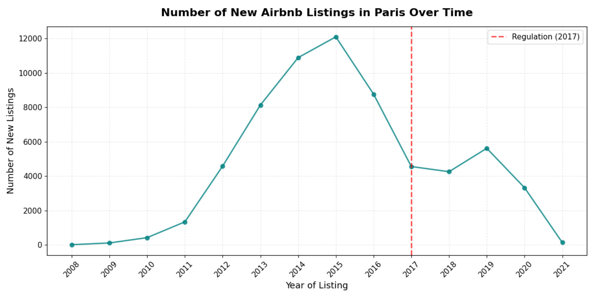
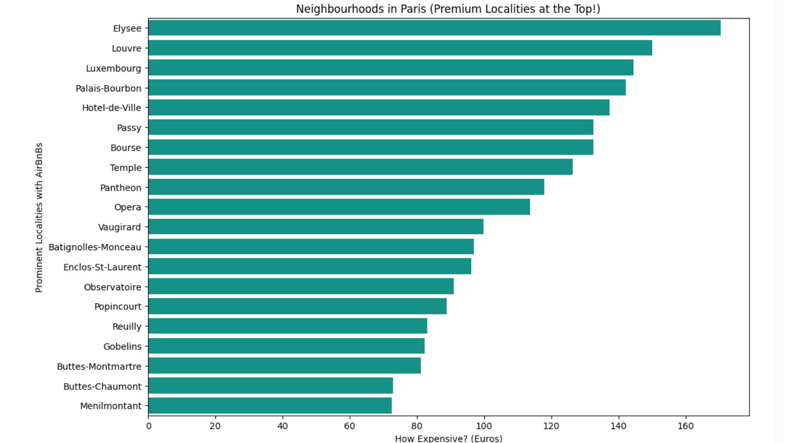
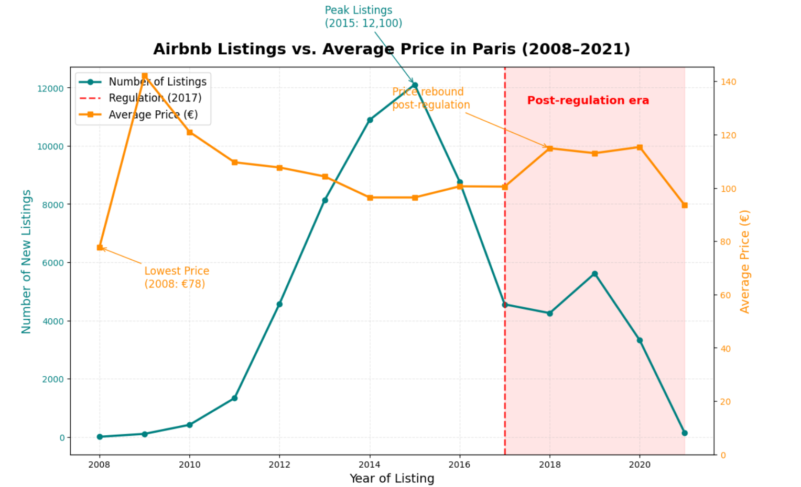

# 🏠 Airbnb Paris Analysis
Analysis of Airbnb Trends in Paris
This project analyzes how the Airbnb market in Paris has changed over time. It focuses on three main factors: **New Government Regulations**, **Neighborhood Trends**, and **Pricing Strategies**. The goal is to understand how these factors affect both the number of hosts (supply) and the number of travelers (demand).

The project involves **Cleaning Raw Data**, **Performing Exploratory Data Analysis (EDA)**, and using visualizations to create practical business advice.


---

## 📌 Objectives

- **Analyze Supply Growth:** Track how the number of listings changed between 2008 and 2021.

- **Evaluate Regulations:** Measure the impact of the 2017 rental laws on new hosts joining the market.

- **Study Pricing:** Compare prices across different neighborhoods to understand affordability.

- **Capacity vs. Price:** examine the link between a property’s size (guest capacity) and its nightly rate.

- **Business Strategy:** Provide data-driven recommendations for stakeholders.

  ---

## 📊 Key Insights
- **Early Boom (2008–2016):** The market grew very fast with many new hosts and listings appearing.

- **Impact of 2017 Rules:** After new regulations passed, the number of new hosts entering the market slowed down significantly.

- **Stable Demand:** Even though fewer new hosts joined, the demand from customers remained strong.

- **Price Changes:** Before 2017, competition kept prices low. After the regulations limited the supply, average prices started to rise.

- **Location Analysis:** Central Paris remains the most expensive area, while outer districts appeal to budget travelers.

  ---

## 🚀 Recommendations

* Focus on **premium central areas** while maintaining offerings in budget-friendly neighborhoods.
* Implement **dynamic pricing** to balance supply-demand fluctuations.
* Diversify listings, especially targeting **medium-capacity stays (3–6 guests)**.
* Strengthen **customer experience** with quality listings and repeat-stay strategies.
* Stay compliant and adapt to evolving **local regulations** for long-term sustainability.

---
## 🛠️ Tech Stack

* **Python** (pandas, numpy) – Data cleaning & processing
* **Matplotlib / Seaborn** – Data visualization
* **Jupyter Notebook** – Interactive analysis

---

## 📂 Project Structure

```
├── data/                  # Raw & cleaned datasets
├── notebooks/             # Jupyter notebooks
├── images/                # Visualizations exported from notebooks
├── requirements.txt       # Dependencies
├── LICENSE                # License file (MIT)
├── README.md              # Project overview (this file)
```

---

## ⚙️ How to Run

1. Clone this repository

   ```bash
   git clone https://github.com/your-username/airbnb-paris-analysis.git
   cd airbnb-paris-analysis
   ```

2. Install dependencies

   ```bash
   pip install -r requirements.txt
   ```

3. Launch Jupyter Notebook

   ```bash
   jupyter notebook
   ```

4. Open `airbnb-paris-analysis.ipynb` and run the cells step by step.

---

## 📊 Results

Here are some key visualizations from the analysis:

* **Growth of Airbnb Listings in Paris**
  

* **Average Price by Locality**
  

* **Impact of 2017 Regulation on Host Entries**
  

---

## 📜 License

This project is licensed under the MIT License - see the [LICENSE](LICENSE) file for details.

---

## 🙌 Acknowledgments

* [Inside Airbnb](http://insideairbnb.com/) for providing the dataset.
* Paris regulatory context from local housing policies.

---

## 🚀 Future Work

* Extend the analysis to other European cities for comparison.
* Add predictive modeling to forecast Airbnb prices.
* Build an interactive dashboard with Plotly or Power BI.

---

✅ **Final Note:**
This project highlights the intersection of **data, policy, and business strategy** in the short-term rental market.
Paris remains a dynamic case study of how regulations reshape supply, demand, and pricing in urban tourism.


